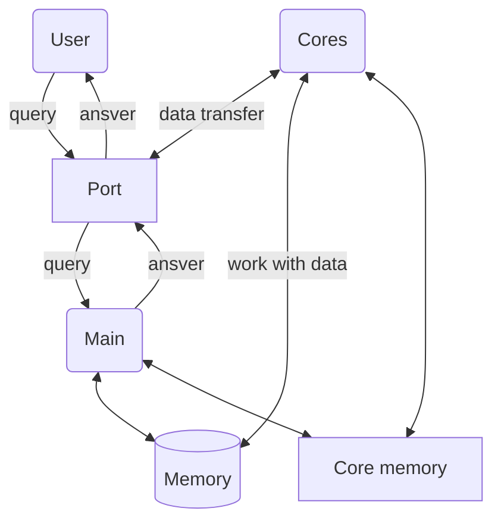

# VSDSFM
Very Simple Data Storage For Mindustry

```mermaid
graph TD
  

user(User)
port[Port]

main(Main)

mem@{ shape: "cyl", label: "Memory" }

core(Cores)
memcore[Core memory]

user --> |query| port
port --> |ansver| user

main --> |ansver| port
port --> |query| main

main <--> mem    

core <--> |data transfer| port
core <-->|work with data| mem
core <-->  memcore
      
main <--> memcore 
```
