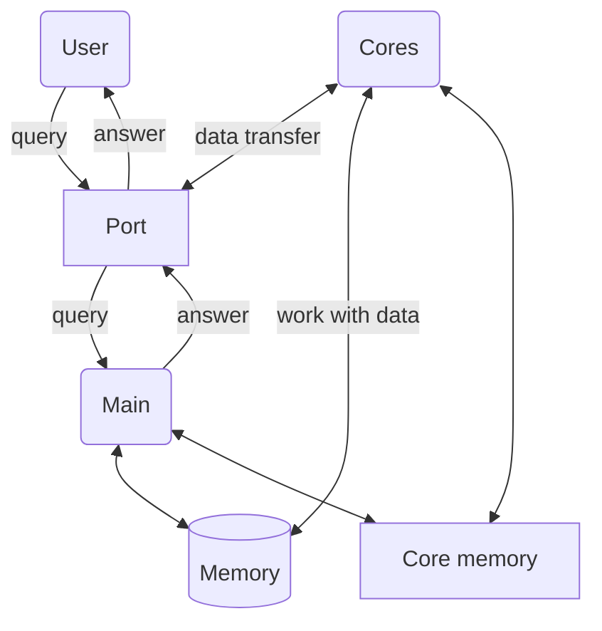
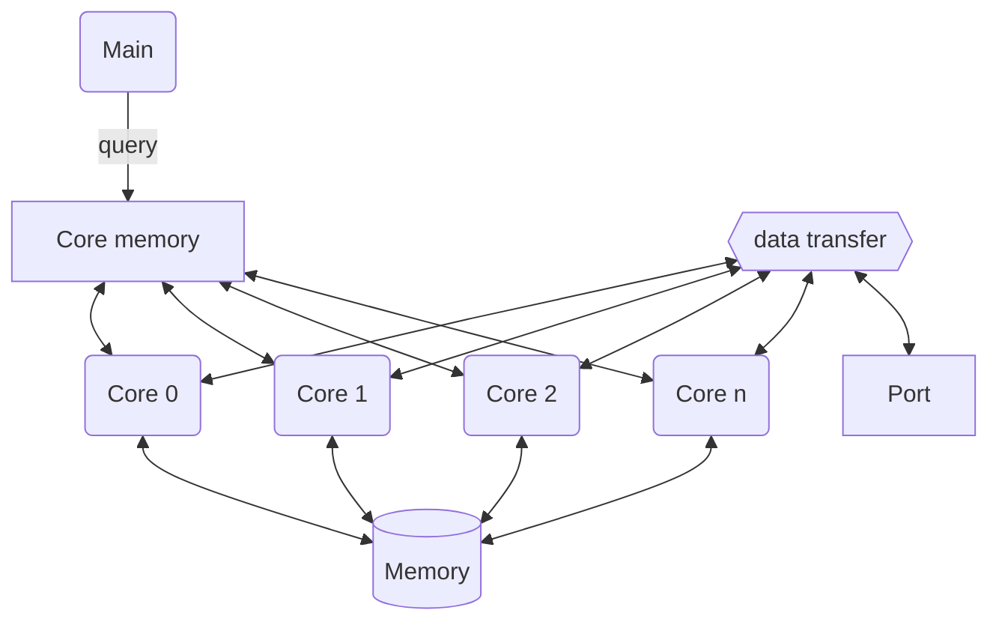

# VSDSFM
Very Simple Data Storage For Mindustry

```mermaid
graph TD
  

user(User)
port[Port]

main(Main)

mem@{ shape: "cyl", label: "Memory" }

core(Cores)
memcore[Core memory]

user --> |query| port
port --> |answer| user

main --> |answer| port
port --> |query| main

main <--> mem    

core <--> |data transfer| port
core <-->|work with data| mem
core <-->  memcore
      
main <--> memcore 
```

```mermaid
graph TD
  
port[Port]

memcore[Core memory]

mem@{ shape: "cyl", label: "Memory" }
main(Main)


main-->|query| memcore

memcore <--> c0
memcore <--> c1
memcore <--> c2
memcore <--> cn

c0(Core 0)
c1(Core 1)
c2(Core 2)
cn(Core n)

c0 <--> mem
c1 <--> mem
c2 <--> mem
cn <--> mem


t@{ shape: "hex", label: "data transfer" }

t <--> c0
t <--> c1
t <--> c2
t <--> cn
t <--> port


```

